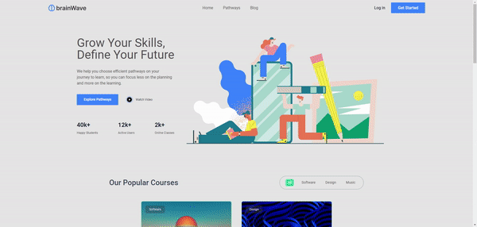
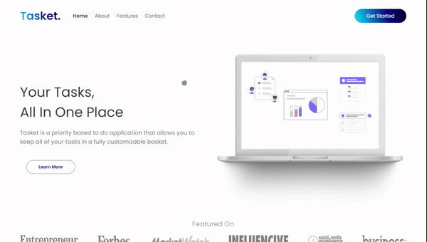
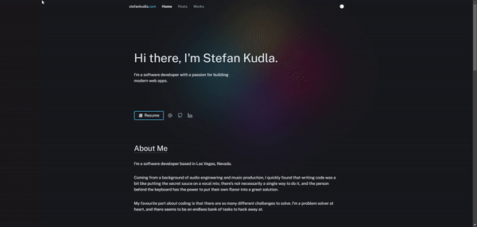

# Hi there, I'm [Stefan][website] 👋

Audio Engineer --> WordPress Developer --> Software Engineer.

I'm driven to create something amazing and make the world a better place in the process.

[View my resume](https://imgix.cosmicjs.com/cc2a92d0-d14a-11ec-9f12-9bd712c1ee68-StefanKudlaResume.pdf)

### Connect with me:

&nbsp;&nbsp;

&nbsp;&nbsp;

&nbsp;&nbsp;

### Languages and Tools:

 

---

### 📕 Recent Projects

<!-- PROJECT:START -->

<table bordercolor="#66b2b2">
  
  <tr>
    <td width="50%" valign="top">
      <h3 align="center">brainwave.com</h3>
         
        
         
        

          
  <a href="https://github.com/stefkudla/brainwave-2" target="_blank">
    Repo
  </a>  
  <a href="https://brainwave2.netlify.app/" target="_blank">
    Live Site
  </a>
      

      
<strong>React.js, TailwindCSS, and Firebase</strong> - Learning platform allowing users to create their own account and learn about various subjects!

    </td>
    <td width="50%" valign="top">
      <h3 align="center">Tasket</h3>
         
        
         
        

          
  <a href="https://github.com/stefkudla/tasket-landing-page" target="_blank">
    Repo
  </a>  
  <a href="https://tasket.netlify.app/" target="_blank">
    Live Site
  </a>
      

      
<strong>HTML, CSS, and JavaScript</strong> - LLanding Page with modern UI/UX and responsive design. Become more productive!

    </td>
  </tr>
 
  <tr>
    <td width="50%" valign="top">
      <h3 align="center">stefankudla.com</h3>
         
        
         
        

          
  <a href="https://github.com/stefkudla/stefankudla.com" target="_blank">
    Repo
  </a>  
  <a href="https://stefankudla.com/" target="_blank">
    Live Site
  </a>
      

      
<strong>TypeScript, Next.js, Tailwind, Cosmic.js and Node.js</strong> - My personal website converted from WordPress to Jamstack.

    </td>
  </tr>
</table>

<!-- PROJECT:END -->

➡️ [Visit my website](https://stefankudla.com/)

---

### 📕 Latest Blog Posts

<!-- BLOG-POST-LIST:START -->

- [How I Started Freelancing As a Web Developer](https://stefankudla.com/posts/how-i-started-freelancing-as-a-web-developer-in-2022)
- [Here’s Why All Musicians Need a Website in 2022](https://stefankudla.com/posts/heres-why-all-musicians-need-a-website-in-2022)
- [Creativity and Software Development Is a Wonderful Combination](https://stefankudla.com/posts/creativity-and-software-development-is-a-wonderful-combination)

<!-- BLOG-POST-LIST:END -->

➡️ [more blog posts...](https://stefankudla.com/posts)

---

[website]: https://stefankudla.com
[beatstore]: https://eversense.beatstars.com/
[spotifykp]: https://open.spotify.com/artist/1CSRNVYpoL50ukBdbFR3vp?si=k_6V5YaiRkideq14-IPSeA
[twitter]: https://twitter.com/stefankudla
[instagram]: https://instagram.com/stefankudla
[linkedin]: https://linkedin.com/in/stefankudla
